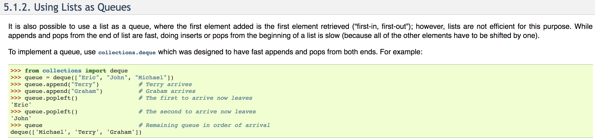

# Breadth-First Search

Breadth-first search is another commonly used graph search algorithm. It can be implemented by maintaining a queue.

## Pseudocode

```text
def BFS (graph, start):
    reached = {start}
    Q = queue data structure initially containing only the start vertex
    while Q not empty:
        v = Q.dequeue()
        for each edge v->w in graph:
            if w not in reached:
            add w to reached
            Q.enqueue(w)
    return reached
```

## Python Implementation

```text
from collections import deque

class BFSearcher:

    def __init__ (self):
        self.reached = list()
        self.queue = deque()
    
    def BFS (self, G, start):
        self.reached.append(start)
        self.queue.append(start)
        while self.queue:
            v = self.queue.popleft()
            edges = G[v]
            for w in edges:
                if w not in self.reached:
                    self.reached.append(w)
                    self.queue.append(w)
        return self.reached
```

Here we used the Python built-in data structure - deque. Deque supports append and popleft, which amounts to the traditional enque and deque for queue data structures. 




BFS generates much shorter paths, and may be a better approach for web crawling.

## Runtime Analysis

Since BFS visits each vertex once and each edge will be looped through once, the whole algorithm takes O\(\|V\|\). However, we need efficient operations for the queue data structure.

